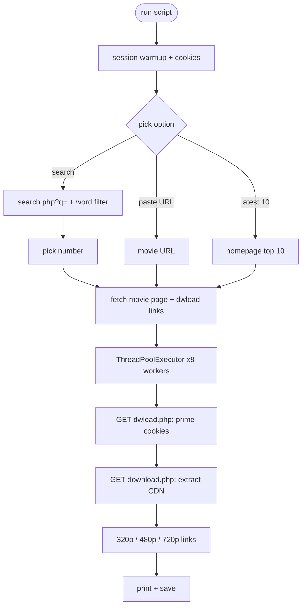

# MoviezWap All-in-One Tool

no cap this tool pulls direct CDN mp4 links from moviezwap.codes. search by name, paste a URL, or just grab the latest drops. no login, no captcha, no browser.

---

## how it flows



---

## what's the site

moviezwap.codes is a desi site with 8,100+ movies across 34+ categories. Telugu, Tamil, Hindi, Hollywood dubs, web series, the whole lot. they hide real CDN URLs behind a two-step PHP redirect to block bots. we cracked it.

---

## features

**1. search that actually works**
the site's own `/?s=` endpoint is cooked, it ignores the query. we use `/search.php?q=` instead, then do a client-side word filter. results grouped by language.

**2. two-step CDN resolver**
real mp4 URLs are locked behind `dwload.php` + `download.php`. we prime session cookies on the first hit, then extract the CDN link from the second response.

**3. parallel resolution**
ThreadPoolExecutor hits all quality links at the same time. 10 movies resolved in under 10s.

**4. 403 bypass**
session warms up on the homepage first, picks up cookies, then all requests go with full browser headers. site thinks it's a real Chrome tab.

**5. full site scan**
crawls all 34+ categories with correct stop logic. site recycles pagination content forever so we track new-vs-seen links to stop at the right time. saves 8k+ titles to JSON.

---

## install

```bash
pip install requests beautifulsoup4 lxml tqdm
```

---

## run

```bash
python moviezwap.py
```

---

## menu

```
[1]  Search movie name  ->  pick  ->  get CDN download links
[2]  Full site scan     ->  list all titles + details
[3]  Paste movie URL    ->  get CDN links instantly
[4]  Latest 10 movies   ->  fetch all CDN links
[0]  Exit
```

---

## example: search

```
Enter movie name to search: pushpa

Found 2 result(s):

-- Telugu -----------------------------------
  [ 1]  Pushpa 2: The Rule (2024) Telugu
  [ 2]  Pushpa: The Rise (2021) Telugu

Enter number: 1

  [320P]  589 MB   Pushpa-2-The-Rule-...-320p-HQ.mp4
  [480P]  814 MB   Pushpa-2-The-Rule-...-480p-HQ.mp4
  [720P]  1135 MB  Pushpa-2-The-Rule-...-720p-HQ.mp4

  https://10g1.moviezzwaphd.xyz/...
  https://10g2.moviezzwaphd.xyz/...
  https://10g1.moviezzwaphd.xyz/...
```

---

## example: latest 10

```
Resolving CDN links for all 10...

100%|################| 10/10 [00:08<00:00]

  Newtons 3rd Law (2026) Telugu ORG HDRip
     [320P] (359 MB)  https://...
     [480P] (496 MB)  https://...
     [720P] (693 MB)  https://...
```

---

## notes

- links have expiry tokens (`&e=...`), they go stale after a few hours so use them quick
- full scan saves to `moviezwap_full_scan.json`
- latest 10 saves to `latest_movies_links.txt` if you say yes

---

## requirements

- Python 3.10+
- requests
- beautifulsoup4
- lxml
- tqdm

---

## disclaimer

this tool is for educational and research purposes only. we do not host, distribute, or endorse any copyrighted content. all links are generated dynamically from publicly accessible URLs on third-party sites. the developers are not responsible for how you use this tool. use at your own risk, comply with the laws of your region.
